# Ovara Agent System Diagrams

This document contains the system architecture diagrams for the Ovara Agent System, showing the multi-agent hierarchy, interaction flows, and MCP server integration.

## 1. Ovara Agent System Architecture

```mermaid
graph TB
    subgraph "External Systems"
        MongoDB[(MongoDB Database)]
        Calendar[Calendar APIs]
        Frontend[Barka Frontend]
        Backend[Barka Backend]
    end

    subgraph "Ovara Agent System"
        subgraph "Entry Point"
            Main[main.py<br/>FastAPI Server]
            Runner[ADK Runner]
            SessionService[Database Session Service]
        end

        subgraph "Agent Hierarchy"
            Gaia[🎯 Gaia<br/>Orchestrator Agent<br/>gemini-2.0-flash-exp]
            
            subgraph "Specialized Agents"
                Discovery[🔍 Discovery Agent<br/>Client Discovery & Requirements<br/>gemini-2.0-flash-exp]
                Documentation[📄 Documentation Agent<br/>Document Generation<br/>gemini-2.0-flash-exp]
                Jarvis[📅 Jarvis Agent<br/>Scheduling & Calendar<br/>gemini-2.0-flash-exp]
                ProjectManager[📋 Project Manager Agent<br/>Project Operations<br/>gemini-2.5-flash-lite]
            end
        end

        subgraph "MCP Integration"
            MCPServer[Python MCP Server<br/>mcp_server.py]
            MCPToolset[MCP Toolset<br/>ADK Integration]
        end

        subgraph "Tools & Capabilities"
            DiscoveryTools[Discovery Tools<br/>• Requirements<br/>• Stakeholders<br/>• Client Info]
            DocTools[Documentation Tools<br/>• SRS Generation<br/>• Contracts<br/>• Proposals]
            CalendarTools[Calendar Tools<br/>• Meeting Scheduling<br/>• Availability<br/>• Business Hours]
            ProjectTools[Project Management Tools<br/>• Teams<br/>• Tasks<br/>• Projects<br/>• Analytics]
        end
    end

    %% Connections
    Frontend --> Main
    Backend --> Main
    Main --> Runner
    Runner --> SessionService
    SessionService --> MongoDB
    Runner --> Gaia

    Gaia --> Discovery
    Gaia --> Documentation
    Gaia --> Jarvis
    Gaia --> ProjectManager

    Discovery --> DiscoveryTools
    Documentation --> DocTools
    Jarvis --> CalendarTools
    Jarvis --> Calendar
    ProjectManager --> MCPToolset
    MCPToolset --> MCPServer
    MCPServer --> ProjectTools
    MCPServer --> MongoDB

    %% Styling
    classDef agentClass fill:#e1f5fe,stroke:#01579b,stroke-width:2px
    classDef toolClass fill:#f3e5f5,stroke:#4a148c,stroke-width:2px
    classDef systemClass fill:#e8f5e8,stroke:#1b5e20,stroke-width:2px
    classDef dbClass fill:#fff3e0,stroke:#e65100,stroke-width:2px

    class Gaia,Discovery,Documentation,Jarvis,ProjectManager agentClass
    class DiscoveryTools,DocTools,CalendarTools,ProjectTools,MCPToolset toolClass
    class Main,Runner,SessionService,MCPServer systemClass
    class MongoDB,Calendar,Frontend,Backend dbClass
```



## 2. Agent Interaction and Handoff Flow

```mermaid
sequenceDiagram
    participant User
    participant Frontend
    participant Main as main.py
    participant Runner as ADK Runner
    participant Gaia as 🎯 Gaia Orchestrator
    participant Discovery as 🔍 Discovery Agent
    participant Documentation as 📄 Documentation Agent
    participant Jarvis as 📅 Jarvis Agent
    participant PM as 📋 Project Manager
    participant MCP as MCP Server
    participant DB as MongoDB

    User->>Frontend: Send message
    Frontend->>Main: HTTP request to /run
    Main->>Runner: Create runner with Gaia
    Runner->>Gaia: Route user message

    Note over Gaia: Analyzes request and determines<br/>which specialized agent to use

    alt Discovery Phase
        Gaia->>Discovery: Route to Discovery Agent
        Discovery->>Discovery: Gather requirements<br/>and stakeholder info
        Discovery-->>Gaia: Return discovery results
        Gaia->>PM: Handoff for project setup
        PM->>MCP: Create project structure
        MCP->>DB: Store project data
    
    else Documentation Phase
        Gaia->>Documentation: Route to Documentation Agent
        Documentation->>Documentation: Generate SRS, contracts,<br/>proposals
        Documentation-->>Gaia: Return documents
    
    else Scheduling Phase
        Gaia->>Jarvis: Route to Jarvis Agent
        Jarvis->>PM: Get team member emails
        PM->>MCP: Query team members
        MCP->>DB: Fetch team data
        MCP-->>PM: Return team info
        PM-->>Jarvis: Provide contact details
        Jarvis->>Jarvis: Schedule meetings<br/>with calendar APIs
        Jarvis-->>Gaia: Confirm scheduling
    
    else Project Management
        Gaia->>PM: Route to Project Manager
        PM->>MCP: Execute project operations
        MCP->>DB: CRUD operations on<br/>projects, tasks, teams
        MCP-->>PM: Return results
        PM-->>Gaia: Provide project updates
    end

    Gaia-->>Runner: Consolidated response
    Runner-->>Main: Stream events
    Main-->>Frontend: HTTP response
    Frontend-->>User: Display results

    Note over User,DB: All agents maintain session state<br/>and can hand off context seamlessly
```



## 3. MCP Server Integration Architecture

```mermaid
graph TB
    subgraph "Project Manager Agent"
        PM[📋 Project Manager Agent<br/>gemini-2.5-flash-lite]
        MCPToolset[MCPToolset<br/>ADK Integration Layer]
    end

    subgraph "MCP Server Process"
        MCPServer[Python MCP Server<br/>mcp_server.py]
        
        subgraph "Tool Categories"
            ProjectTools[Project Management Tools<br/>• list_projects<br/>• get_project<br/>• create_project<br/>• update_project]
            
            TeamTools[Team Management Tools<br/>• list_team_members<br/>• get_team_member<br/>• create_team_member<br/>• get_team_performance]
            
            TaskTools[Task Management Tools<br/>• list_tasks<br/>• get_task<br/>• create_task<br/>• update_task]
            
            AnalyticsTools[Analytics Tools<br/>• get_project_progress<br/>• get_team_workload<br/>• performance_metrics]
        end
        
        subgraph "ADK Integration"
            ADKTools[ADK FunctionTool Instances]
            Converter[adk_to_mcp_tool_type<br/>Conversion Layer]
        end
    end

    subgraph "Database Layer"
        MongoDB[(MongoDB Database)]
        Collections[Collections:<br/>• projects<br/>• team_members<br/>• tasks<br/>• clients<br/>• organizations]
    end

    subgraph "Communication Protocol"
        StdIO[Standard I/O<br/>Communication]
        MCPProtocol[Model Context Protocol<br/>JSON-RPC Messages]
    end

    %% Connections
    PM --> MCPToolset
    MCPToolset --> StdIO
    StdIO --> MCPServer
    MCPServer --> ADKTools
    ADKTools --> Converter
    Converter --> ProjectTools
    Converter --> TeamTools
    Converter --> TaskTools
    Converter --> AnalyticsTools
    
    ProjectTools --> MongoDB
    TeamTools --> MongoDB
    TaskTools --> MongoDB
    AnalyticsTools --> MongoDB
    
    MongoDB --> Collections
    
    MCPServer --> MCPProtocol
    MCPProtocol --> StdIO

    %% Tool execution flow
    MCPServer -.->|list_tools()| Converter
    MCPServer -.->|call_tool()| ADKTools
    ADKTools -.->|execute| MongoDB

    %% Styling
    classDef agentClass fill:#e1f5fe,stroke:#01579b,stroke-width:2px
    classDef mcpClass fill:#f3e5f5,stroke:#4a148c,stroke-width:2px
    classDef toolClass fill:#e8f5e8,stroke:#1b5e20,stroke-width:2px
    classDef dbClass fill:#fff3e0,stroke:#e65100,stroke-width:2px
    classDef protocolClass fill:#fce4ec,stroke:#880e4f,stroke-width:2px

    class PM agentClass
    class MCPServer,MCPToolset mcpClass
    class ProjectTools,TeamTools,TaskTools,AnalyticsTools,ADKTools,Converter toolClass
    class MongoDB,Collections dbClass
    class StdIO,MCPProtocol protocolClass
```

## Diagram Descriptions

### System Architecture
The first diagram shows the complete Ovara Agent System architecture, including:
- **External Systems**: Frontend, Backend, MongoDB, and Calendar APIs
- **Entry Point**: FastAPI server, ADK Runner, and Session Service
- **Agent Hierarchy**: Gaia orchestrator with four specialized sub-agents
- **MCP Integration**: Python MCP Server and ADK integration layer
- **Tools & Capabilities**: Specialized tools for each agent domain

### Interaction Flow
The sequence diagram illustrates how user requests flow through the system:
- User interactions start at the frontend and flow through the ADK Runner to Gaia
- Gaia analyzes requests and routes them to appropriate specialized agents
- Agents collaborate through handoffs when cross-domain expertise is needed
- The Project Manager agent uniquely integrates with the MCP server for advanced capabilities
- All interactions maintain session state for seamless context preservation

### MCP Server Integration
The third diagram details the MCP server architecture:
- **Project Manager Agent**: Uses MCPToolset for MCP integration
- **Tool Categories**: Four main categories of project management tools
- **ADK Integration**: Conversion layer between ADK and MCP protocols
- **Database Layer**: Direct MongoDB access for high-performance operations
- **Communication Protocol**: Standard I/O and JSON-RPC messaging

These diagrams provide a comprehensive visual representation of the Ovara Agent System's sophisticated multi-agent architecture and its integration with the Model Context Protocol for advanced project management capabilities.
